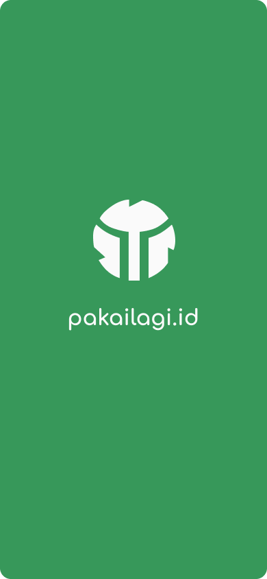
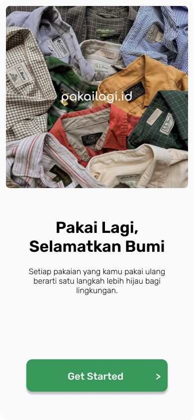
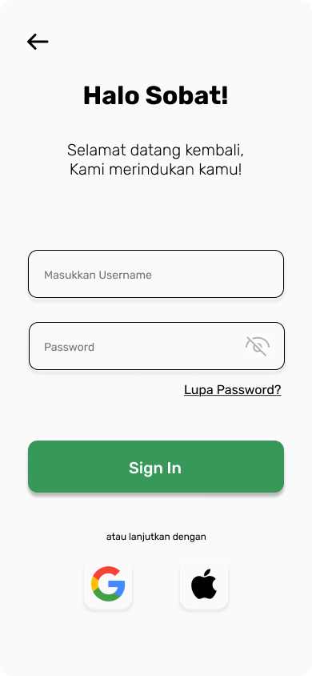

# 🌿 PakaiLagi.id

> **Aplikasi thrifting pakaian ramah lingkungan untuk gaya hidup berkelanjutan.**

---

## 📖 Deskripsi Singkat Aplikasi
**PakaiLagi.id** adalah aplikasi thrifting pakaian berbasis lingkungan yang mengajak masyarakat untuk menggunakan kembali pakaian bekas layak pakai.  
Melalui aplikasi ini, pengguna dapat **menjual, membeli, dan berbagi pakaian bekas berkualitas** guna mengurangi limbah tekstil serta mendukung gaya hidup berkelanjutan.

---

## 👥 Anggota Kelompok
 - Andreas Cristianto Sinaga    *231402029*
 - Samuel Gautama Manik         *231402056*
 - Kevin Namalo Sirait          *231402099*
 - Elvan Yohanes Gultom         *231402132*

---

## ✨ Rencana Fitur Aplikasi

### 1. CRUD (Create, Read, Update, Delete)
Mendukung proses pengelolaan data secara penuh, meliputi pembuatan, penayangan, pembaruan, dan penghapusan postingan pakaian bekas. Fitur ini menjadi inti sistem jual-beli dalam aplikasi.

### 2. Authentication (google, apple, native)
Aplikasi Menyediakan sistem autentikasi yang aman dan fleksibel, memungkinkan pengguna untuk masuk menggunakan akun Google, Apple, atau melalui pendaftaran native.

### 3. User Location
Menggunakan lokasi pengguna untuk menampilkan penjual atau pembeli terdekat, sehingga proses transaksi menjadi lebih mudah, cepat, dan efisien.

### 4. User Profile
Menampilkan informasi pengguna, daftar barang yang dijual, serta riwayat transaksi.

### 5. Data Storage (REST API & Firebase)
Menyimpan seluruh data pengguna, transaksi, dan media secara aman melalui integrasi REST API dan Firebase, menjamin ketersediaan serta konsistensi data di seluruh platform.

---

## 🧩 Deskripsi Project
|         Kategori       |        Keterangan        |
|------------------------|--------------------------|
|   **Jenis Aplikasi**   |      Cross Platform      |
|      **Framework**     |          Flutter         |
| **Bahasa Pemrograman** |           Dart           |
|     **Version SDK**    |    Flutter SDK 3.35.0    |
|     **Android SDK**    |      Version 36.1.0      | 
|         **IDE**        | VS Code / Android Studio | 

---

## 🧱 Implementasi Layout Dasar (3 Halaman)
Dapat dilihat pada tautan figma berikut: https://www.figma.com/design/YurNtDFBSFp1e0cekH6O1j/UI-DESIGN?node-id=0-1&t=hgt4E52uiY95WwO9-1
password = pakailagi.id

---

## 📸 Screenshot Aplikasi

**Splash Screen**

**Get Started**

**Login Page**

